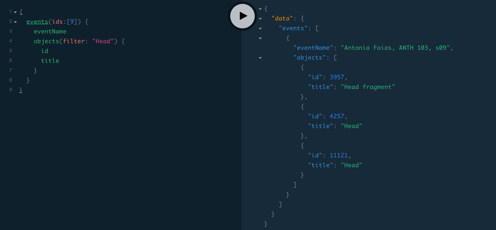

# Williams College Museum of Art (WCMA) API

The collection data is from [*Collection*](https://github.com/wcmaart/collection) and is CC0 licensed, see that repository for more details

# Getting started

First, clone this repo and its submodules
```
git clone --recursive https://github.com/wcmaart/api
```

When you do a git pull in the future, you will also need to ensure the submodules are up to date
```
git submodule update --init --recursive
```
As a shortcut, you can use this npm package script
```
npm run pull
# Note: this is a shortcut for `git pull && git submodule update --init --recursive`
```

You will need to add the emuseum api key as an environment variable.
Please copy and rename the `.env.example` file to `.env`. And replace the value for `EMUSEUM_KEY` with the correct key obtained from the dev team.

Now install and start the app.
```bash
npm install
npm start
```

You will probably want to visit [http://localhost:4000/playground]() and [http://localhost:4000/voyager]()

# Technologies



Right now this is a graphql endpoint, that can

* query objects

```graphql
{
  objects(ids:[123]) {
    title

    raw {
      ...on EmuseumObject {
        primaryMedia {
          value
        }
      }
      ...on CsvObject {
        filename
      }
    }

	}
}
```

* query events

> what were all the artwork titles present in event 9

```graphql
{
  events(ids:[9]) {
    eventName
    objects {
      title
    }
  }
}
```

* proxy egallery images:

```bash
# grab the url of an image from the graphql api
$ graphqlResponse=$(curl http://localhost:4000/graphql -H 'content-type: application/json' -d '{"query": "{ objects(ids: [123]) { raw { ... on EmuseumObject { primaryMedia { value } } } } }"}')
# extract out the image url
$ primaryMedia=$(echo $graphqlResponse | jq -r '.data.objects[0].raw.primaryMedia.value')
# grab the latest image through the proxy
curl http://localhost:4000/egallery/$primaryMedia -o 123.jpg
# open the image
open 123.jpg
```

* query a test endpoint

```graphql
{
    hello {
      there
    }
}
```

* update the test endpoint

```graphql
mutation {
    setHello(there: "Monsieur Kenobi") {
      there
    }
}
```

Note that mutations will return the previous data if successful

# Philosophy

* Examples are more humane than documentation
* The less technologies the better
